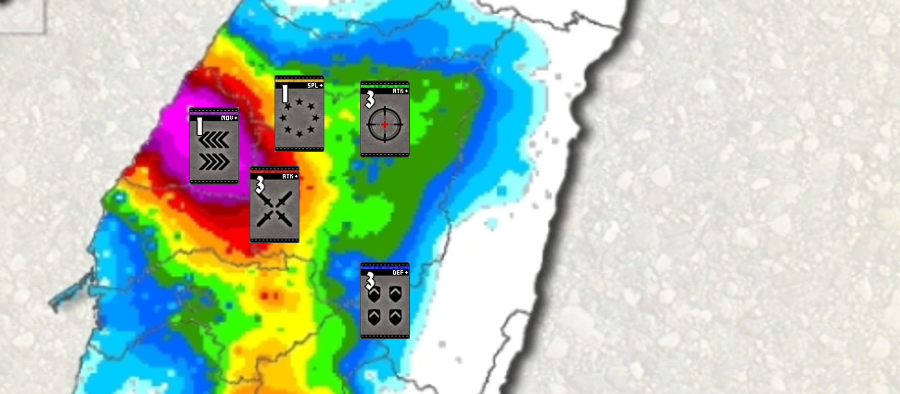

<p align="center">
  
</p>

# Unlight 對戰紀錄系統

這是一個用於 **Unlight 遊戲分析** 的專案，功能包含：

- 自動匯入對戰紀錄 (JSON)
- MySQL 資料庫儲存
- PHP + Bootstrap 前端顯示
- 排行榜、角色資料、卡片資訊

📌 Demo: [Unlight 排行榜系統](https://service.uve.com.tw/unlight/ranking.php)

## 專案結構

```
unlight/
    icon/
        god.ico
    assets/
        banner.png
        style.css
        script.js
    steam/
        data/
            .env.example
            channel_watcher_unlight.py
            import_and_compare.py
            ranking_bp.json
            ranking_qp.json
    database/
        schema.sql
    bp/
    qp/
    README.md
    .gitignore
    config.php
    settings.php
    ranking_bp.php
    ranking_qp.php
    eventindex.php
    weapon.php
```

## 安裝需求 (Requirements)

- PHP 7.4+
- MySQL 5.7+ 或 MariaDB
- Python 3.9+ (用於匯入腳本)
- Composer / Node.js (若有前端依賴)

## 使用方法

1. 複製專案  
   ```bash
   git clone git@github.com:Leway813/Unlight.git
   ```

2. 建立資料庫  
   ```bash
   mysql -u <user> -p unlight < database/schema.sql
   ```

3. 建立環境檔案  
   ```bash
   cp steam/data/.env.example steam/data/.env
   ```

4. 啟動服務器，並開啟瀏覽器查看排行榜與對戰紀錄
